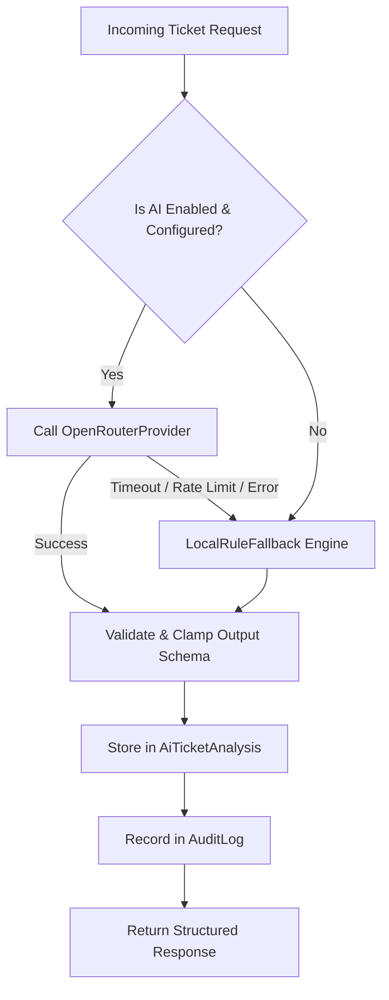

# ServiceDesk Pro — IT Helpdesk & Asset Management System

ServiceDesk Pro is a modern, enterprise-ready IT Service Management (ITSM) and Asset Management solution built with the MERN stack.

---

## 🛠 Tech Stack

- **Backend**: Node.js, Express.js (ES Modules)
- **Database**: MongoDB with Mongoose ODM
- **Authentication**: JWT (Access Tokens + Refresh Tokens) with bcryptjs password hashing
- **Authorization**: Role-Based Access Control (RBAC) & Department scoping
- **Lifecycle Engine**: Strict state machine validation & SLA policy deadline monitoring
- **Asset Lifecycle**: Finite-state asset tracking (Available, Assigned, Repair, Replaced, Lost, Retired)
- **Knowledge Base**: Full-text searchable self-service articles with version history, bookmarks, and ticket recommendations
- **Frontend**: React 19, Vite 8

---

## 📁 Repository Structure

```text
servicedesk-pro/
├── client/                     # Frontend (React 19 + Vite)
│   ├── src/
│   ├── package.json
│   └── vite.config.js
├── server/                     # Backend (Node.js ESM + Express)
│   ├── src/
│   │   ├── config/             # DB & seed configuration
│   │   ├── controllers/        # Request handling and response dispatch
│   │   ├── jobs/               # Background task definitions (SLA escalation monitor)
│   │   ├── middleware/         # Auth, RBAC, error & 404 middleware
│   │   ├── models/             # Mongoose schemas (User, Department, Ticket, Asset, Vendor, Article, etc.)
│   │   ├── routes/             # RESTful API route definitions
│   │   ├── services/           # Business logic (Ticket, Asset, Article, SLA, Audit, Notifications)
│   │   ├── utils/              # Tokens, constants, errors, slugify, responses
│   │   └── validators/         # Input validation middleware
│   ├── server.js               # Server entry point
│   ├── package.json
│   ├── .env.example            # Environment variable template
│   └── test_runner.js          # Automated end-to-end API test suite
├── .gitignore
└── Readme.md
```

---

## 🚀 Getting Started

### 1. Prerequisites
- [Node.js](https://nodejs.org/) (v18 or higher recommended)
- [MongoDB](https://www.mongodb.com/try/download/community) running locally on port `27017` or a MongoDB Atlas URI

### 2. Backend Setup
1. Open a terminal in the `server` directory:
   ```bash
   cd server
   npm install
   ```
2. Configure your environment variables:
   - Copy `.env.example` to `.env`:
     ```bash
     copy .env.example .env
     ```
   - Customize `PORT`, `MONGODB_URI`, `JWT_ACCESS_SECRET`, `JWT_REFRESH_SECRET`, and `CLIENT_URL` if needed.
3. Seed the database with demo departments, SLA policies, vendors, assets, knowledge articles, and role-based test users:
   ```bash
   npm run seed
   ```
4. Start the backend:
   ```bash
   # Development mode (with live watch)
   npm run dev

   # Or standard production start
   npm start
   ```

### 3. Run Automated Tests
Execute the end-to-end test suite:
```bash
cd server
npm test
```

---

## 👥 Demo Seed Credentials

| Role | Email | Password | Scope / Permissions |
|---|---|---|---|
| **System Admin** | `admin@servicedesk.local` | `Password@123` | Full administrative control |
| **IT Manager** | `manager@servicedesk.local` | `Password@123` | Ticket assignment, SLA policies, asset & article management |
| **Asset Manager** | `assetmgr@servicedesk.local` | `Password@123` | Asset procurement, lifecycle actions, vendor catalog |
| **Technician** | `tech1@servicedesk.local` | `Password@123` | Ticket resolution, work logs, author knowledge articles |
| **Employee** | `employee1@servicedesk.local` | `Password@123` | Create tickets, view assigned assets, read KB & bookmark |

---

## 🔄 Lifecycle State Machines

### 1. Ticket Lifecycle
```text
    ┌────────┐
    │  OPEN  │ ──(Assign)──> ┌──────────┐
    └────────┘               │ ASSIGNED │ ──(Start)──> ┌─────────────┐
                             └──────────┘              │ IN_PROGRESS │
                                                       └─────────────┘
                                                              │
                                                          (Resolve)
                                                              ▼
    ┌────────┐               ┌──────────┐              ┌─────────────┐
    │ CLOSED │ <───(Close)── │ REOPENED │ <──(Reopen)─ │  RESOLVED   │
    └────────┘               └──────────┘              └─────────────┘
                                  │
                               (Start)
                                  ▼
                           ┌─────────────┐
                           │ IN_PROGRESS │
                           └─────────────┘
```

### 2. Asset Lifecycle
```text
                     ┌───────────┐
                     │ AVAILABLE │ ◄──────(Return / Recover)─────┐
                     └─────┬─────┘                               │
                           │                                     │
                       (Assign)                                  │
                           ▼                                     │
                     ┌───────────┐                               │
        ┌─────────── │ ASSIGNED  │ ─────────────┐                │
        │            └─────┬─────┘              │                │
        │                  │                    │                │
     (Repair)          (Replace)            (Report Lost)        │
        ▼                  ▼                    ▼                │
 ┌──────────────┐   ┌─────────────┐       ┌───────────┐          │
 │ UNDER_REPAIR │   │  REPLACED   │       │   LOST    │ ─────────┘
 └──────┬───────┘   └──────┬──────┘       └─────┬─────┘
        │                  │                    │
        └───────┐          │          ┌─────────┘
                ▼          ▼          ▼
                     ┌───────────┐
                     │  RETIRED  │ (Terminal State)
                     └───────────┘
```

### 3. Knowledge Article Lifecycle
```text
              ┌─────────┐
              │  DRAFT  │ ◄──────(Unpublish)──────┐
              └────┬────┘                         │
                   │                              │
               (Publish)                          │
                   ▼                              │
             ┌───────────┐                        │
             │ PUBLISHED │ ───────────────────────┤
             └─────┬─────┘                        │
                   │                              │
               (Archive)                          │
                   ▼                              │
             ┌───────────┐                        │
             │ ARCHIVED  │ ──────(Unpublish)──────┘
             └───────────┘
```

---

## 📡 API Endpoints Catalog

### Health & Auth
| Method | Endpoint | Description | Access |
|---|---|---|---|
| `GET` | `/api/health` | Service & database connectivity check | Public |
| `POST` | `/api/auth/register` | Register employee account | Public |
| `POST` | `/api/auth/login` | Authenticate with email/password | Public |
| `POST` | `/api/auth/refresh` | Rotate access token | Public |
| `GET` | `/api/auth/me` | Fetch active user profile | Authenticated |
| `POST` | `/api/auth/logout` | Revoke session refresh token | Authenticated |

### Tickets & Workflow
| Method | Endpoint | Description | Access |
|---|---|---|---|
| `POST` | `/api/tickets` | Create ticket (auto-calculates SLA deadlines) | Authenticated |
| `GET` | `/api/tickets` | List tickets (filtered by status, priority, search, page; scoped by role) | Authenticated |
| `GET` | `/api/tickets/:id` | Get ticket details and live SLA state | Scoped |
| `PATCH` | `/api/tickets/:id` | Update metadata (priority change triggers SLA recalculation) | Authorized |
| `POST` | `/api/tickets/:id/assign` | Assign ticket to technician (`OPEN` $\rightarrow$ `ASSIGNED`) | `system_admin`, `it_manager` |
| `POST` | `/api/tickets/:id/start` | Start working on ticket (`ASSIGNED` $\rightarrow$ `IN_PROGRESS`) | Assigned Technician, Managers |
| `POST` | `/api/tickets/:id/resolve` | Mark ticket resolved with notes (`IN_PROGRESS` $\rightarrow$ `RESOLVED`) | Assigned Technician, Managers |
| `POST` | `/api/tickets/:id/reopen` | Reopen resolved ticket (`RESOLVED` $\rightarrow$ `REOPENED`) | Requester, Managers |
| `POST` | `/api/tickets/:id/close` | Confirm closure of resolved ticket (`RESOLVED` $\rightarrow$ `CLOSED`) | Requester, Managers |
| `GET` | `/api/tickets/:id/audit` | View immutable audit trail events | Scoped |
| `GET` | `/api/tickets/:id/comments` | List comments (internal notes hidden from employee) | Scoped |
| `POST` | `/api/tickets/:id/comments` | Post comment (support staff can flag `isInternal`) | Scoped |
| `GET` | `/api/tickets/:id/worklogs` | View technician time records | Technicians, Managers |
| `POST` | `/api/tickets/:id/worklogs` | Log effort time in minutes | Technicians, Managers |

### Knowledge Base Module
| Method | Endpoint | Description | Access |
|---|---|---|---|
| `GET` | `/api/articles/summary` | Aggregated metrics (most viewed, helpful, categories) | Authenticated |
| `GET` | `/api/articles/search` | Full-text relevance search (`?q=<query>`) | Authenticated (Scoped) |
| `GET` | `/api/articles/recommendations` | Ticket-matched article recommendations (`?ticketId=`) | Authenticated (Scoped) |
| `GET` | `/api/articles/bookmarks/me` | Fetch user's saved article bookmarks | Authenticated |
| `POST` | `/api/articles` | Create article draft (creates Version 1) | Support Staff |
| `GET` | `/api/articles` | List articles with filters (`category`, `tag`, `visibility`) | Authenticated (Scoped) |
| `GET` | `/api/articles/:id` | Get article by ID or slug (increments view count) | Authenticated (Scoped) |
| `PATCH` | `/api/articles/:id` | Update article content (creates new version history) | Author or Managers |
| `DELETE` | `/api/articles/:id` | Delete article and related versions/bookmarks | `system_admin`, `it_manager` |
| `POST` | `/api/articles/:id/publish` | Publish article (`DRAFT` $\rightarrow$ `PUBLISHED`) | Author or Managers |
| `POST` | `/api/articles/:id/archive` | Archive article (`PUBLISHED` $\rightarrow$ `ARCHIVED`) | Author or Managers |
| `POST` | `/api/articles/:id/unpublish`| Revert article back to `DRAFT` | Author or Managers |
| `POST` | `/api/articles/:id/helpful` | Record helpful feedback vote (prevents duplicate vote)| Authenticated |
| `POST` | `/api/articles/:id/not-helpful` | Record not-helpful feedback vote | Authenticated |
| `POST` | `/api/articles/:id/bookmark` | Bookmark article for quick access | Authenticated |
| `DELETE` | `/api/articles/:id/bookmark` | Remove article bookmark | Authenticated |
| `GET` | `/api/articles/:id/versions` | View historical revisions and changelogs | Support Staff |

### Asset Management
| Method | Endpoint | Description | Access |
|---|---|---|---|
| `GET` | `/api/assets/summary` | Aggregated dashboard KPI statistics | Authenticated |
| `GET` | `/api/assets/warranty/expiring` | Query expiring warranties (`?days=30`) | Authenticated |
| `POST` | `/api/assets` | Register new inventory asset | `system_admin`, `it_manager`, `asset_manager` |
| `GET` | `/api/assets` | List assets (scoped by role, search, category, vendor) | Authenticated |
| `GET` | `/api/assets/:id` | Get asset details | Scoped |
| `PATCH` | `/api/assets/:id` | Update asset metadata (lifecycle status protected) | `system_admin`, `it_manager`, `asset_manager` |
| `DELETE` | `/api/assets/:id` | Delete asset record (guarded against active tickets) | `system_admin` only |
| `POST` | `/api/assets/:id/assign` | Assign asset to employee | `system_admin`, `it_manager`, `asset_manager` |
| `POST` | `/api/assets/:id/unassign` | Unassign asset back to `AVAILABLE` | `system_admin`, `it_manager`, `asset_manager` |
| `POST` | `/api/assets/:id/repair` | Mark asset as `UNDER_REPAIR` | Managers, Technicians |
| `POST` | `/api/assets/:id/return` | Return asset from repair back to `AVAILABLE` | Managers, Technicians |
| `POST` | `/api/assets/:id/replace` | Mark asset as `REPLACED` (optionally link new unit) | `system_admin`, `it_manager`, `asset_manager` |
| `POST` | `/api/assets/:id/retire` | Permanently retire asset (`RETIRED`) | `system_admin`, `it_manager`, `asset_manager` |
| `POST` | `/api/assets/:id/report-lost`| Report asset as `LOST` (triggers manager alerts) | Assigned Employee, Managers |
| `POST` | `/api/assets/:id/recover` | Recover lost asset back to `AVAILABLE` | `system_admin`, `it_manager`, `asset_manager` |
| `GET` | `/api/assets/:id/history` | View immutable lifecycle history audit log | Scoped |
| `GET` | `/api/assets/:id/tickets` | View all helpdesk tickets linked to this asset | Scoped |

### Vendor Management
| Method | Endpoint | Description | Access |
|---|---|---|---|
| `GET` | `/api/vendors` | List supplier/vendor profiles | Authenticated |
| `GET` | `/api/vendors/:id` | Get vendor details | Authenticated |
| `POST` | `/api/vendors` | Create vendor | `system_admin`, `it_manager`, `asset_manager` |
| `PATCH` | `/api/vendors/:id` | Update vendor information | `system_admin`, `it_manager`, `asset_manager` |
| `DELETE` | `/api/vendors/:id` | Delete vendor (guarded against active assets) | `system_admin` only |

### SLA Policies & Notifications
| Method | Endpoint | Description | Access |
|---|---|---|---|
| `GET` | `/api/sla` | List configured SLA targets | Authenticated |
| `GET` | `/api/sla/:id` | Get specific SLA policy | Authenticated |
| `POST` | `/api/sla` | Create new SLA policy | `system_admin`, `it_manager` |
| `PATCH` | `/api/sla/:id` | Update SLA response/resolution targets | `system_admin`, `it_manager` |
| `DELETE` | `/api/sla/:id` | Delete SLA policy | `system_admin`, `it_manager` |
| `GET` | `/api/notifications` | View in-app user notifications (with unread count) | Authenticated |
| `PATCH` | `/api/notifications/:id/read` | Mark notification as read | Authenticated |
| `PATCH` | `/api/notifications/read-all` | Mark all notifications as read | Authenticated |

### AI Ticket Intelligence Engine
| Method | Endpoint | Description | Access |
|---|---|---|---|
| `POST` | `/api/ai/tickets/:id/analyze` | Full AI ticket analysis (category, priority, risks, solution draft) | Support Staff & Ticket Owner |
| `GET` | `/api/ai/tickets/:id/history` | View historical AI analyses for a ticket | Support Staff (`system_admin`, `it_manager`, `technician`) |
| `GET` | `/api/ai/tickets/:id/recommendations` | AI-refined Knowledge Base article recommendations | Authenticated (Scoped) |
| `POST` | `/api/ai/tickets/:id/solution-draft` | Generate a grounded troubleshooting draft using KB | Support Staff & Ticket Owner |
| `POST` | `/api/ai/tickets/:id/apply-category` | Explicitly apply AI-recommended category to ticket | Support Staff & Ticket Owner |
| `POST` | `/api/ai/tickets/:id/apply-priority` | Explicitly apply AI-recommended priority (recalculates SLA) | `system_admin`, `it_manager` |

---

## 🤖 AI Ticket Intelligence Engine Architecture

ServiceDesk Pro includes a dedicated, provider-agnostic **AI Ticket Intelligence Engine** designed with strict reliability, safety, and human-in-the-loop controls.

### 1. Architectural Layers

```text
server/src/services/ai/
├── aiProvider.js            # Base provider abstraction interface
├── openRouterProvider.js    # Production HTTP client for OpenRouter completions
├── mockAiProvider.js        # Deterministic mock provider for automated testing and CI
├── localRuleFallback.js     # Production deterministic fallback engine for zero-downtime resilience
├── promptBuilder.js         # Prompt generators with input sanitization and JSON schema constraints
└── aiService.js             # High-level orchestrator and analysis persistence
```

### 2. Multi-Tier Resilience & Fallback Strategy

The AI module is engineered so that **AI is never a single point of failure**:



1. **`openrouter` (Production Provider)**: Communicates via native `fetch` with OpenRouter using strict abort timeouts (`AI_TIMEOUT_MS`).
2. **`mock_provider` (Automated Tests)**: Deterministic mock AI provider used during test runs to ensure rapid, reproducible results with zero external dependencies.
3. **`local_rule_fallback` (Production Fallback)**: Automatically activates if OpenRouter is disabled, rate-limited, unreachable, or missing credentials. Provides deterministic classification, priority recommendation, risk detection, grounded KB matching, and safe standard troubleshooting drafts:
   ```json
   {
     "aiAvailable": false,
     "source": "local_rule_fallback"
   }
   ```

### 3. Human-in-the-Loop Safeguards

* **No Unsolicited Mutations**: AI analysis **never** directly mutates ticket fields automatically.
* **Explicit Action Endpoints**:
  * `POST /api/ai/tickets/:id/apply-category` — Allows support staff or the ticket owner to adopt the suggested category.
  * `POST /api/ai/tickets/:id/apply-priority` — Restricted strictly to `system_admin` and `it_manager`. Triggers automatic recalculation of SLA response and resolution deadlines.
* **Comprehensive Audit Trail**: Every analysis run and applied recommendation generates an immutable audit record (`AI_ANALYSIS_PERFORMED`, `AI_CATEGORY_APPLIED`, `AI_PRIORITY_APPLIED`, `AI_ESCALATION_RECOMMENDED`).

### 4. Security & Privacy Protections

* **Input Sanitization**: All prompts automatically redact Bearer tokens, JWTs, passwords, API keys, and credit card numbers prior to transmission.
* **No Secret Leakage**: API keys and tokens are never returned in responses or persisted in analysis history models.
* **Strict Validation**: All outputs are clamped and validated against existing enums (`TICKET_CATEGORIES`, `TICKET_PRIORITIES`, `["LOW", "MEDIUM", "HIGH", "CRITICAL"]`).

### 5. Manual Smoke Test with Live OpenRouter API

To test with a live OpenRouter model:
1. Obtain an API key from [OpenRouter](https://openrouter.ai/).
2. In `server/.env`, configure:
   ```bash
   AI_ENABLED=true
   AI_PROVIDER=openrouter
   OPENROUTER_API_KEY=sk-or-v1-your-actual-api-key
   OPENROUTER_MODEL=google/gemini-2.5-flash
   ```
3. Start the server (`npm start` or `npm run dev`).
4. Log in as an IT Manager (`manager@servicedesk.local`).
5. Send a request to analyze any ticket:
   ```bash
   curl -X POST http://localhost:5000/api/ai/tickets/<TICKET_ID>/analyze \
     -H "Authorization: Bearer <MANAGER_ACCESS_TOKEN>"
   ```
6. Verify the response contains `{ "aiAvailable": true, "source": "openrouter" }` with structured classification, priority, risks, and solution draft.

